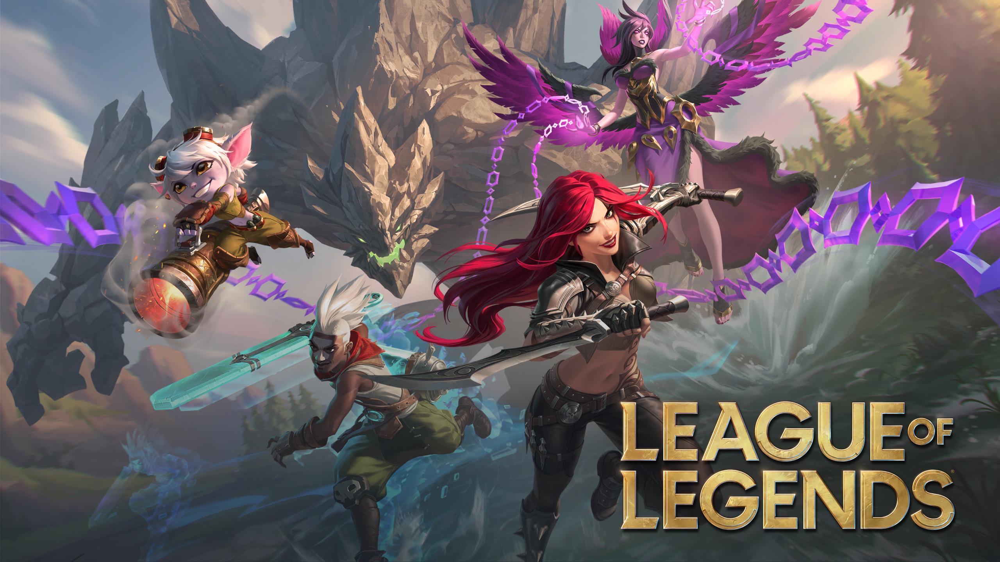

# League of Legends SNOWFLAKE ELT Data Pipeline

**Continuously-running LoL analytics pipeline built entirely on Snowflake's free trial tier.**

1. This project was built on a set of readily available .csv from Kaggle --> [*source*](https://www.kaggle.com/datasets/nathansmallcalder/league-of-legends-match-interval-snapshots-2026/data). The dataset itself was in turn sourced from [*Raw Community Dragon*](https://raw.communitydragon.org/).

2. This project ingests the same raw data incrementally, simulating one day of real-world ingestion at a time, rather than a one-shot load. For a oneshot ETL version of this pipeline, built on Databricks, see [*here*](https://github.com/TotoriYoyori/league-databricks).

3. And yes, you can **[deploy your own copy](setup/INSTALL_GUIDE.md)** as well on Snowflake! 

### Visit the following two Streamlit apps powered by the pipeline, both runnable as standalone demos and Snowflake live apps.
* [Item Browser](https://github.com/TotoriYoyori/league-snowflake-item-browser): A simple champion/item browser
* [Role Importance](https://github.com/TotoriYoyori/league-snowflake-role-importance): Simple logistic regression model 
that predicts win rate from gold leads per lane.

> *"League of Legends SNOWFLAKE ELT Data Pipeline" was created under Riot Games' "Legal Jibber Jabber" policy using assets owned by Riot Games. Riot Games does not endorse or sponsor this project.*

---
## Gallery

### Orchestration

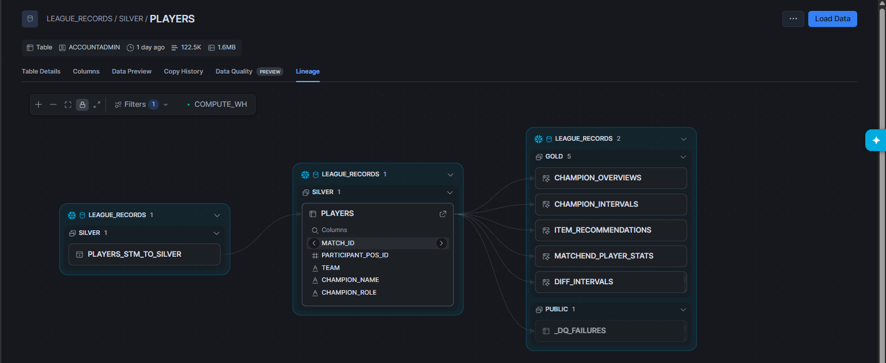

> *Lineage graph of SILVER.PLAYERS. A stream is hooked up to BRONZE.PLAYERS, cleaned using a view DDL
then inserted. The table is then used downstream for other GOLD tables.*

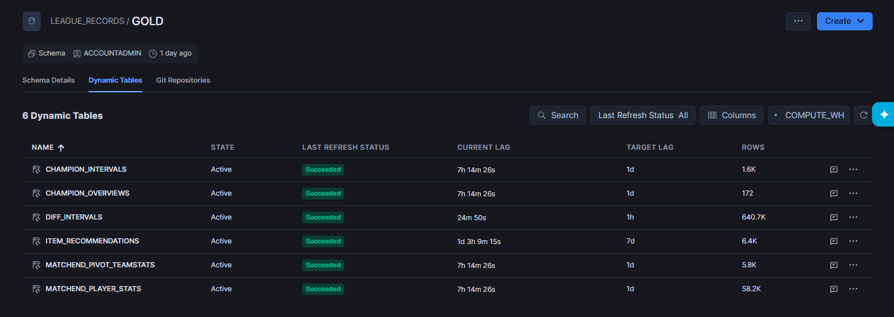

> *Each table listed in gold are the result of aggregating continuously incrementing data upstream. 
Each are cleaned, reliable, refresh at their own cadence (target lag), and ready for end-user consumptions!*

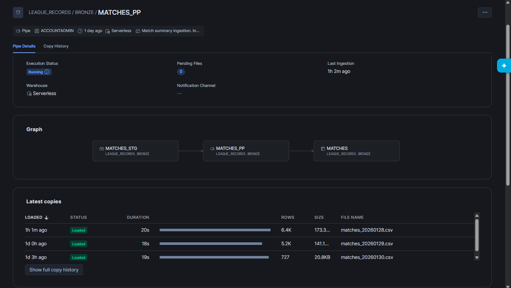

> *The pipeline's SNOWPIPE are capable of ingesting continuous data from source .csv files.*

### Data Showcase

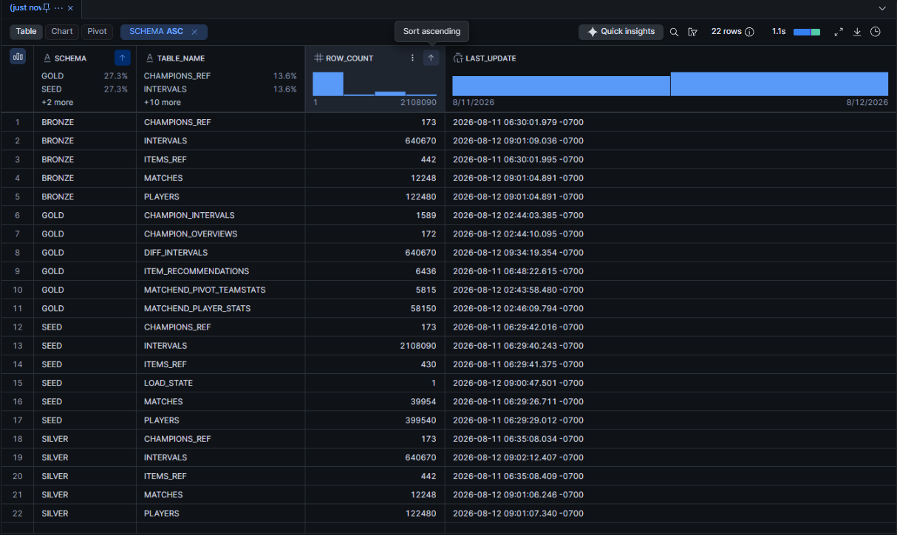
> *Data is flowing through every layer at once.*

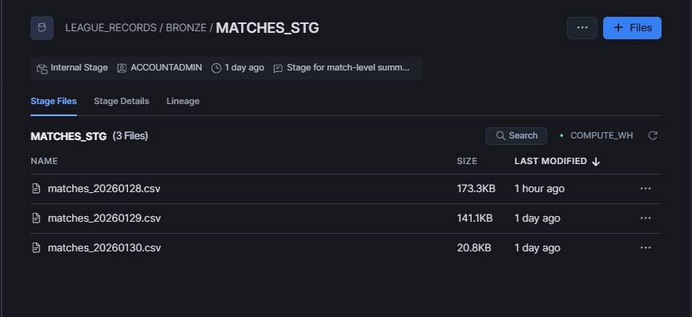
> *The stage is ready for daily file drop. I use a simple internal stage here for demoing purposes, but 
in production, this can easily be swapped out for an external Cloud stage capable of auto-ingestion using event messages.*

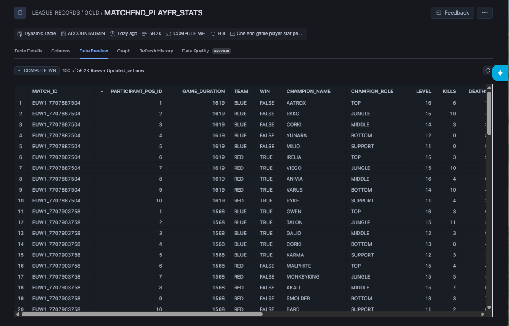
> *Data preview of the gold table MATCHEND_PLAYER_STATS.*

### Streamlit Apps (you can see more by visiting their individual repos)

https://github.com/user-attachments/assets/bec8d85d-05b3-4950-942e-661b332abc89

> *Video showcase of the 'Role Importance' Streamlit app: deployed live on Snowflake, training from continuous data,
making predictions for win probability based on different real life scenario of gold lead per lane! Built using 
a simple Logistic Regression model.*

https://github.com/user-attachments/assets/afc52ffc-011c-4f14-930e-afe003bc4825

> *Video showcase of the 'Item Browser' Streamlit app: deployed live on Snowflake, aggregating from continuous data,
allowing you to see what other players are building right now on your favorite champion, and even find out
hidden gems / trap items.*

### Monitoring & Health Checks

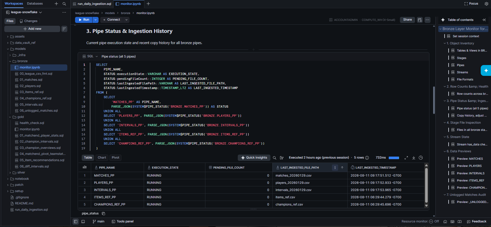

> *See how the pipeline is doing. At each layer, there is a monitor.ipynb notebook that user can simply run from top to 
bottom to get a quick diagnosis glance.*

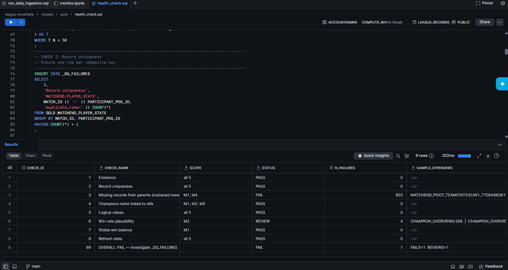

> *health_check.sql is a diagnosis script that you can run as often as you want.*

### Notebook & Modelling

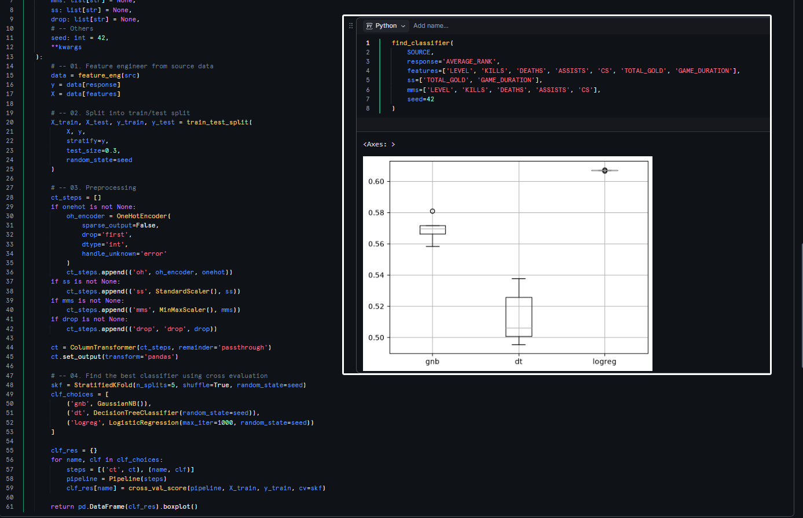

> *Sample notebook of a workflow where I would try to find the best classifier model for identifying player rank from 
their matchend statistics. But it seems the models all underfit for now ...*

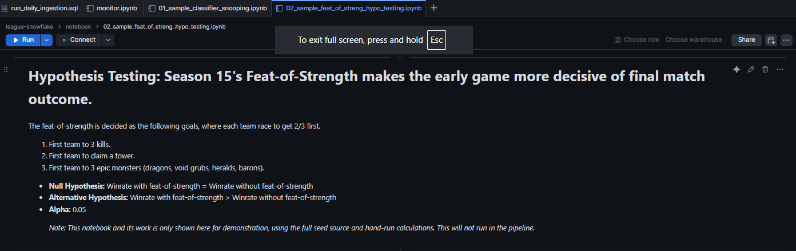

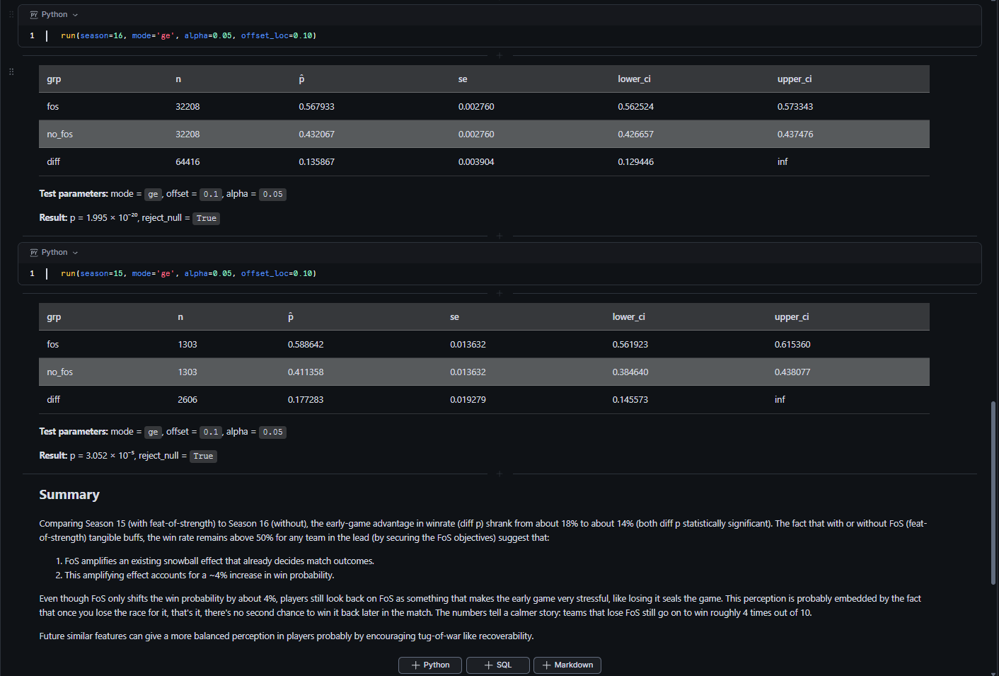

> *Another sample notebook where I tried to test if the feature 'Feat of Strength' introduced in Season 15, then removed
later in Season 16 had an impact toward game balance. Results showed that the feature amplified the early-game
snowball effect, but only for a modest ~4% win rate diff.*

---
## Project Structure

```
league-snowflake/
├── assets/                   # images
├── data_vault_ref/           # archived earlier modeling approach (reference only)
├── models/
│   ├── _infra/               # DDL for schemas, seed tables, and simulated-load procedures
│   ├── bronze/               # raw ingestion: tables, streams, stages, pipes
│   ├── silver/               # cleaning views, tables, and merge tasks
│   └── gold/                 # dynamic tables + health_check.sql
├── notebook/                 # Demo notebooks for DS/ML workflows.
├── patch/                    # ad-hoc fixes applied to the live pipeline over time
├── setup/                    # all setup steps in order + teardown file.
└── run_daily_ingestion.sql   # one-click: ingest the next simulated day
```

---
## Portfolio Reflection
Here I give a brief post-mortem of the development of this project ~~that I cooked up for fun~~.

### The initial problem
There wasn't one, honestly. I found a Kaggle dataset: 5 CSVs, 2.1 million rows, League of Legends match data, 
and thought: I could build a real ETL pipeline out of this. I love video games, I always wanted to work in games, 
and I am good at data stuff, so this was a fun exercise.

### Initial thinking
I wanted to do "classical" ETL with Python/Apache, and then upload to Snowflake, but that tooling is Linux-only, so I 
decided to just do everything on Snowflake instead. This flips the order into ELT. I also modeled it as a Data Vault 
at first, mostly because I wanted to learn Data Vault.

### Challenges, solutions, and what I learned.
1. **Data Vault wasn't a good fit.** It is built for integrating multiple, continuously-updating sources. 
League match logs are all append-only, so I ended up hashing keys nobody would ever join on for example. Around the 
same time I was building the "honest, what I'd actually do" version of this pipeline on Databricks **(one-shot instead 
of masquerading through simulated daily loads)** and it just used medallion architecture. Seeing how much simpler that 
was helped convinced me to switch from Data Vault to a medallion architecture. 

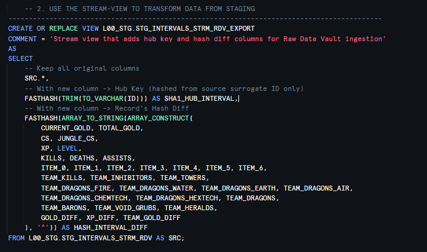

2. **Originally I also wanted to normalize or partition** the intervals table (`SILVER.INTERVALS`) into individual grains
because at source it was a ~36 column wide table. I tried modeling it as team-level intervals plus player-level intervals.
But that introduced unneeded complexity for a table that wouldn't be queried anyway (only ever used to make gold tables).
I tried a single-wide version on Databricks (ingesting the whole 36 columns as is) and it was much easier. So I kept it.

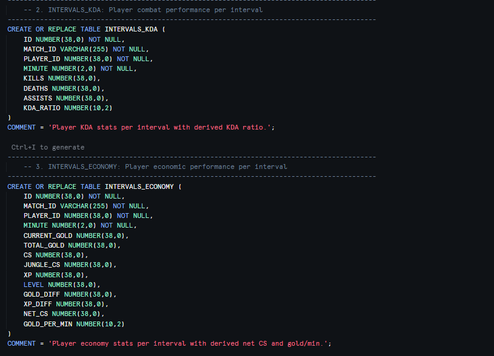

3. Making this reproducible was its own challenge. I dropped an **auto-ingesting cloud-stage design** because I can't 
make people spin up their own cloud account, and **cut a planned third Streamlit app for pipeline monitoring** once 
I realized it added nothing over the monitoring I already had (`monitor.ipynb` notebooks + `health_checks.sql`). 

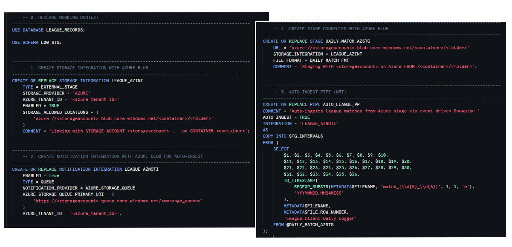

4. Then there's Fiddlesticks. Originally I wanted to prettify-format champion names **from PascalCase to Title Case**
(because it would make it easier downstream for display, since that is how League client renders their name). I wrote 
a function for it that broke on exactly one champion: Fiddlesticks, because the refs file and the player logs disagreed 
on its internal capitalization. I tried to manually patch it with an update statement, but I thought it was pretty 
silly to do so. I accepted that a database's job is to hold the truth, not prettify. I decided to uppercase all 
champion names since that is the easier thing to do to integrate the two differing naming convention.

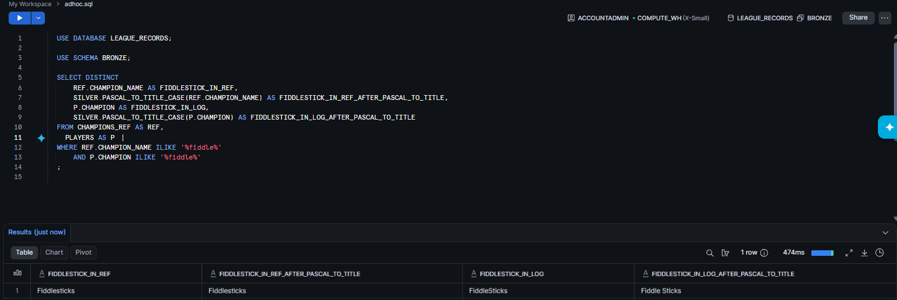

5. Building the Databricks twin also taught me something less flattering about Snowflake: it's genuinely weak for
engineering work: no native SCD Type 2, cleaning logic is SQL-only, and the free trial's blocked external access made
seeding and deployment harder than it needed to be. Snowflake just queries faster once the data's already sitting there. 
If I hit this exact problem with real stakeholders tomorrow, I'd engineer in Databricks, and analyze in Snowflake.

---
**Built with** --> Snowflake | SQL | Python | Hard work

**Python Library Used** --> Streamlit | Pandas | NumPy | Matplotlib | Seaborn | Sklearn | Statsmodel | And others ...

> *If you like my work and would like to discuss employment opportunities --> **email: stan.mng@gmail.com***.
