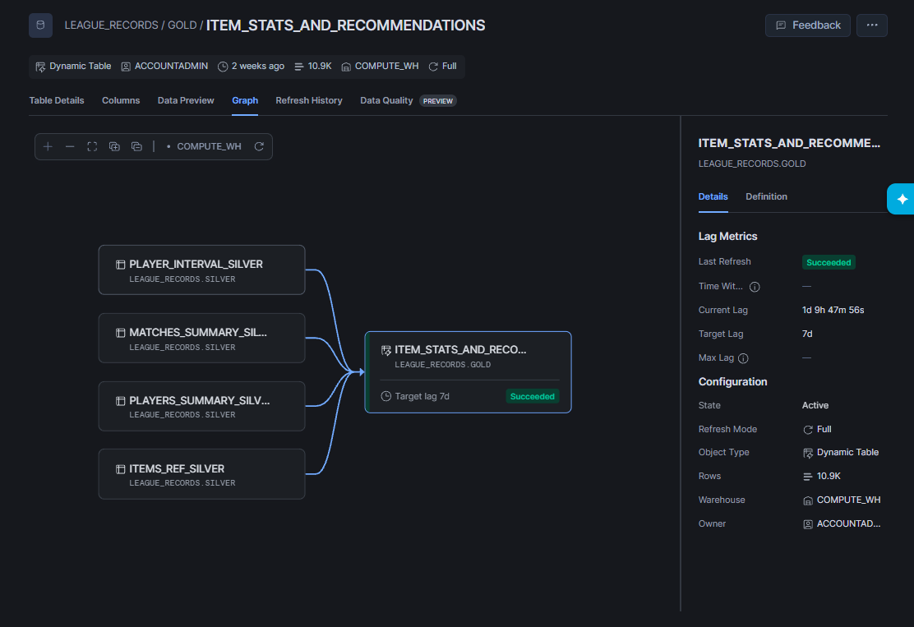
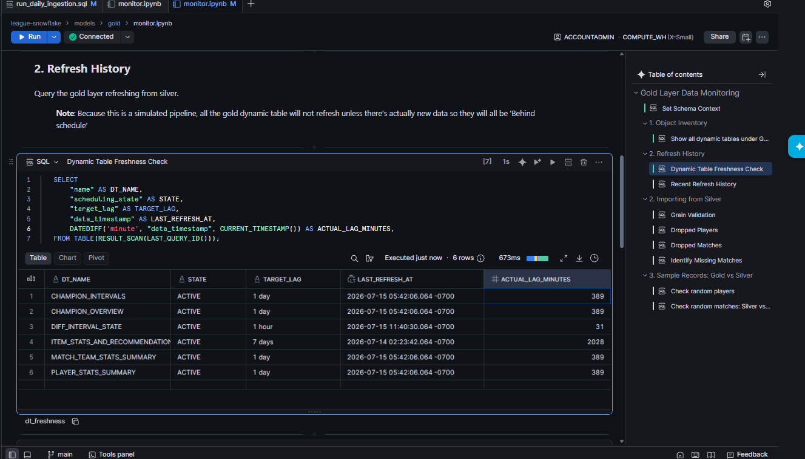
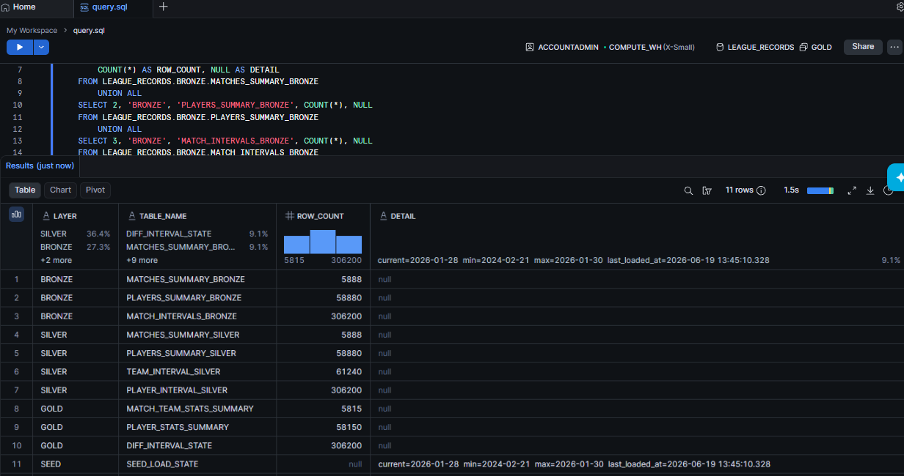
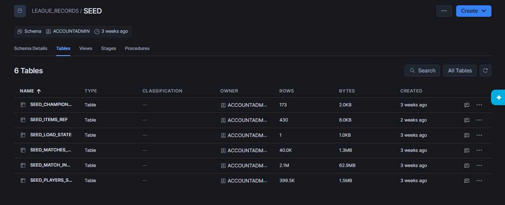
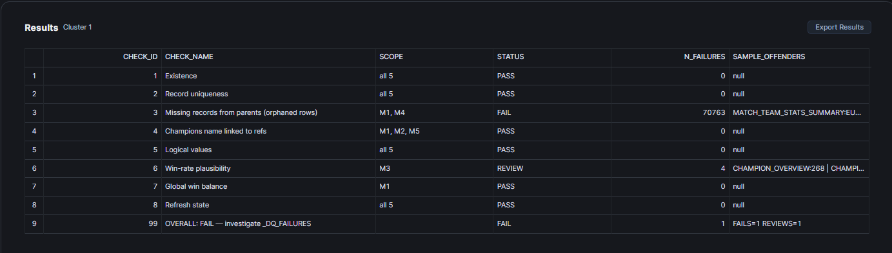

# League of Legends SNOWFLAKE ELT Data Pipeline

**Continuously-running LoL analytics pipeline built entirely on Snowflake's free trial tier in under a month. 2.1 million time-series snapshots, incrementally ingested across ~700 simulated days, powering three live Streamlit apps.**

1. This project was built on a set of readily available .csv from Kaggle --> [*source*](https://www.kaggle.com/datasets/nathansmallcalder/league-of-legends-match-interval-snapshots-2026/data). The dataset itself was in turn sourced from [*Raw Community Dragon*](https://raw.communitydragon.org/).

2. This project ingests the same raw data incrementally, simulating one day of real-world ingestion at a time, rather than a one-shot load. For a oneshot ETL version of this pipeline, built on Databricks, see [*here*](https://github.com/TotoriYoyori/league-databricks).

> *"League of Legends SNOWFLAKE ELT Data Pipeline" was created under Riot Games' "Legal Jibber Jabber" policy using assets owned by Riot Games. Riot Games does not endorse or sponsor this project.*

---

## Gallery

### 1. Orchestration

https://github.com/user-attachments/assets/c3680031-7c95-44e1-8029-f626c2f202a4
> *The pipeline and all its objects in the database tree.*


> *Gold's dynamic table lineage and refresh lag example.*


> *Each Gold table refreshes on its own independent schedule.*

### 2. Data Showcase


> *One query confirms data is flowing correctly through every layer at once.*


> *Full historical dataset loaded once into SEED, ready to be simulated day-by-day into Bronze.*


> *Click-and-run data quality suite covering all 5 Gold tables.*

---

## Project Structure

```
league-snowflake/
├── assets/
├── data_vault_ref/     # archived earlier modeling approach (reference only)
├── models/
│   ├── _infra/         # DDL for schemas, seed tables, and simulated-load procedures
│   ├── bronze/         # raw ingestion: tables, streams, stages, pipes
│   ├── silver/         # cleaning views, tables, and merge tasks
│   └── gold/           # dynamic tables + health_check.sql
├── notebook/           # EDA and modelling notebooks
├── patch/              # ad-hoc fixes applied to the live pipeline over time
├── setup/              # all setup steps in order
└── run_daily_ingestion.sql   # one-click: ingest the next simulated day
```

---

## Prerequisites to Deploy

* A Snowflake account with the `ACCOUNTADMIN` role.
* A running virtual warehouse (`COMPUTE_WH` by default).

> *Info: A free Snowflake trial account covers everything above. A couple of optional automation features (like external network access for auto-downloading seed files) are disabled by default on trial accounts, but neither is required to deploy or run this pipeline.*

---

## How to Deploy Your Own Copy

1. Run `setup/01_deploy.sql` to create the database and deploy `_infra` → bronze → silver → gold.
2. Upload the 5 seed CSVs to `@SEED.UPLOAD_STG` via the Snowsight UI.
3. Run `setup/02_seed_source.sql` to load the seed data and kickstart the first simulated day.
4. Run `setup/03_activate_tasks.sql` to activate the bronze → silver tasks.
5. Run `setup/04_create_streamlit_app.sql` to deploy the three Streamlit apps.
6. From here on, run `run_daily_ingestion.sql` any time you want to ingest another simulated day.

Full walkthrough with screenshots --> **[`setup/INSTALL_GUIDE.md`](setup/INSTALL_GUIDE.md)**

---

## The Streamlit Apps

Three apps, each capable of running LIVE on Snowflake or fully offline against mock CSV exports.

1. **[Itemization Explorer](https://league-sf-item-browser.streamlit.app/)**: pick a champion and browse every item by buy rate and win rate. Employ empirical-Bayes shrinkage for noisy low-n buy samples.

https://github.com/user-attachments/assets/b4bfd5aa-1652-4e3f-8759-45b5abeab6c9

2. **[Role Importance](https://league-sf-role-importance.streamlit.app/)**: a logistic regression model that turns each lane's gold diff at a chosen match minute into a win coefficient. Same model also powers a live predictor: type in 5 gold diffs, get a win probability back.

https://github.com/user-attachments/assets/eb6cd0ef-abc9-4505-b540-1eff1882ee90

3. **[Pipeline Monitor](https://league-sf-pipeline.streamlit.app/)**: a live dashboard for the pipeline itself: 27 checks across Seed, Bronze, Silver, and Gold. From ingestion progress, stream lag, task history, to Gold refresh state, all in one place.

https://github.com/user-attachments/assets/8df32ce6-13bb-42e8-b6f3-41875744a125

---

**Built with** --> Snowflake | SQL | Python (Streamlit)

**Python Library Used** --> Streamlit | Pandas | And others...

> *If you like my work and would like to discuss employment opportunities --> **email: stan.mng@gmail.com***.
