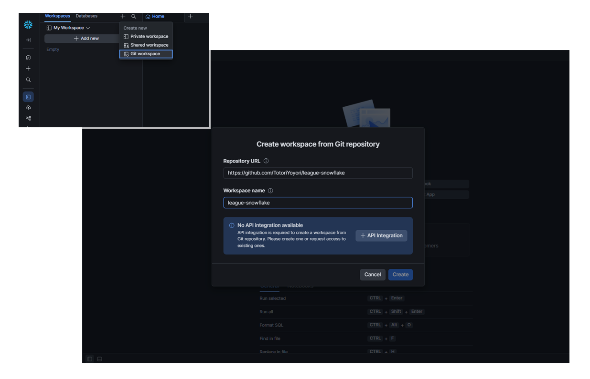
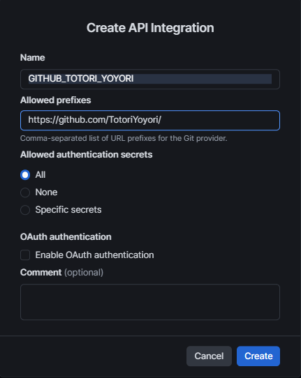
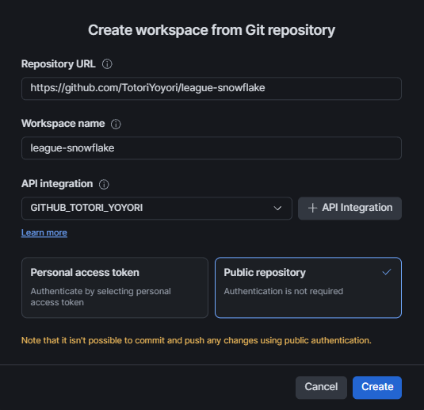
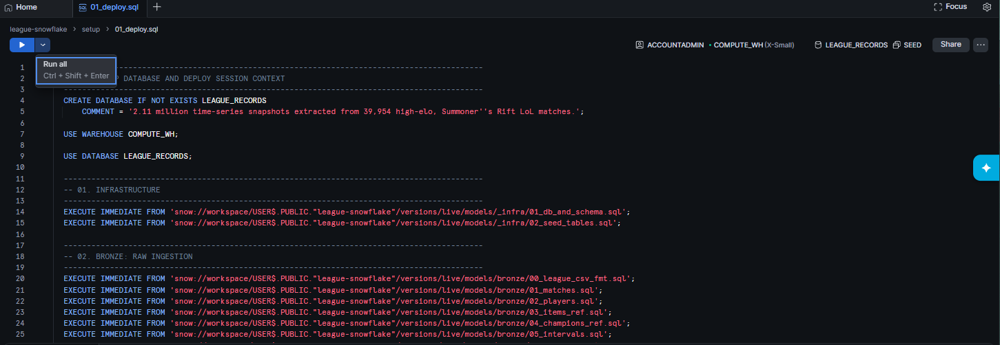
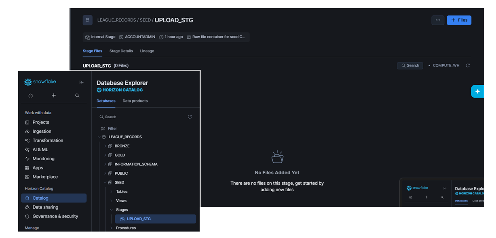
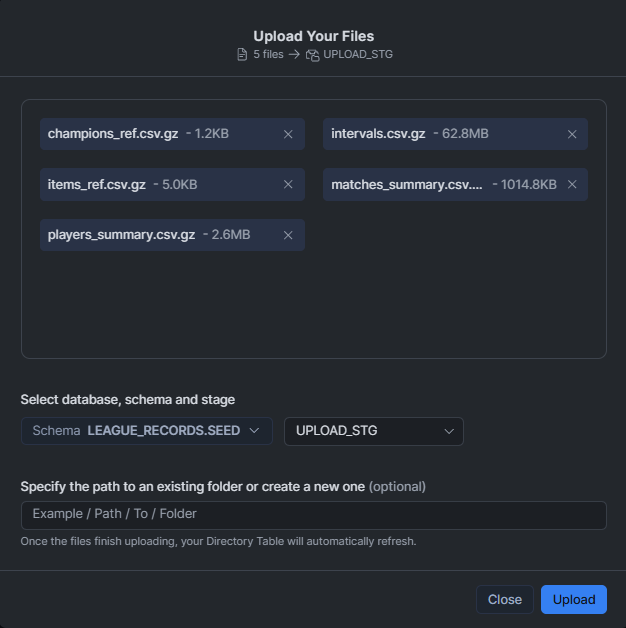
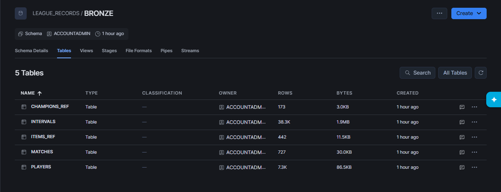
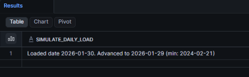

# Install Guide

## Prerequisites
* A **Snowflake account** with `ACCOUNTADMIN` role (a free trial works perfectly)

---

## 01. Create the Workspace

First, you'll connect this repo to Snowflake as a **Workspace** so you can run the SQL files directly.

In Snowsight:

1. Click **Workspaces** (top-left nav)
2. Click **+** → **Create new → Git Workspace**
3. In the resulting window, fill out the forms exactly as shown:
   * Repository URL: `https://github.com/TotoriYoyori/league-snowflake`
   * Workspace name: `league-snowflake`
   


4. Click **+ API Integration** and fill out the form as followed, then hit **Create**.
   * Name: `GITHUB_TOTORI_YOYORI`
   * Allowed prefix: `https://github.com/TotoriYoyori/`



5. You will then go back to the previous screen to complete your workspace. Select the API integration `GITHUB_TOTORI_YOYORI`
you just created (it should be auto-populated), select **Public Repository** and hit **Create**.

> **Warning:** Keep the Workspace name exactly `league-snowflake` (Snowsight defaults to this from the repo URL,
don't rename it!). Every `EXECUTE IMMEDIATE FROM 'snow://workspace/USER$.PUBLIC."league-snowflake"/...'` 
call in `01_deploy.sql` depends on this name. See picture below for example of this name.



You'll now see every file in the repo in your Workspace file tree.

> **Info:** The workspace fetches a read-only copy of the repo (that means no pushing). You can open and run 
any `.sql` file directly from the tree. 

---
## 02. Deploy the Pipeline

Open `setup/01_deploy.sql` from the file tree, then hit **Run All** at the top left.



---

## 03. Download the Data

Go to the **GitHub releases** page:

**https://github.com/TotoriYoyori/league-snowflake/releases/tag/sample**

**Download these 5 files under Assets:**

| File | Rows | Size |
|------|------|------|
| `matches_summary.csv.gz` | ~40K | 1 MB |
| `players_summary.csv.gz` | ~400K | 2.5 MB |
| `intervals.csv.gz` | ~2.1M | ~64 MB |
| `items_ref.csv.gz` | 635 | 6 KB |
| `champions_ref.csv.gz` | 173 | 2 KB |

---

## 04. Upload to the Seed Stage

1. In Snowsight, in the sidebar to the left, navigate to: **Catalog → Databases → LEAGUE_RECORDS → SEED → Stages → UPLOAD_STG**



2. Click **+ Files** and upload all 5 files you just downloaded to **SEED.UPLOAD_STG**



> **Tip:** The files can be in any order. The stage just needs to see these prefixes: `matches_summary`, 
`players_summary`, `intervals`, `items_ref`, `champions_ref`.

Internal-stage directory listings can lag a few seconds behind an upload. If `02_seed_source.sql`'s validation 
step (next) reports a file missing right after you just uploaded it, wait a moment and re-run rather than assuming 
the upload failed.

---
## 05. Load the Seed Data

Open `setup/02_seed_source.sql` and **Run All.** 

> **Warning:** If the validation fails, don't skip it and run the COPY statements manually. Go back and upload the 
missing files first. The COPY INTO will succeed on empty stage paths without error. It'll just load zero rows silently.

You will see a batch of ~700 matches will have been uploaded and ingested into the bronze tables.



---
## 06. Activate the Tasks

Open `setup/03_activate_tasks.sql` and **Run All.**

Each task runs on a **1-minute schedule** and only fires when its bronze stream has new data. No data in the stream? 
It skips, no cost accrued.

> **Tip:** Give it a minute or two for the first scheduled run to actually fire, afterward you will see actual data in your table.

---
## 07. Deploy the Streamlit Apps

Open `setup/04_create_streamlit_app.sql` and **Run All**.

### Find your apps
In Snowsight, in the sidebar: **Projects → Streamlit**. 


Click any app name to open it. Each opens against the `STREAMLIT_WH` warehouse created above.
First load may take a few seconds for the warehouse to figure things out. Also note that **the pipeline needs
time to process new data**, so it might take up to 5 minutes before your app picks up new data and loads correctly.

----
# How to Use

## Simulate Daily Ingestion

Whenever you want to ingest 'another day worth of data', open `run_daily_ingestion.sql` at the workspace root 
and click **Run All**.

The seed tables hold the *full* historical dataset. The `SIMULATE_DAILY_LOAD()` procedure stages **one day at a time**.
This is my version of mock-pretend continuous data ingestion.



You might notice that in this pipeline the **latest date is ingested first then going backward**. 
This is because the number of records are sparse on older dates unfortunately...

> **Info:** You will have already loaded one day back in [Load the Seed Data](#05-load-the-seed-data)!

## Don't See Any Data?

If you don't see data in your silver layer immediately after refreshing the task, this is normal. 
Give it 1-5 minutes for the task to pick up on new changes. You can check task history with:

```sql
SELECT NAME, STATE, QUERY_START_TIME
FROM TABLE(INFORMATION_SCHEMA.TASK_HISTORY(
    SCHEDULED_TIME_RANGE_START => DATEADD('hour', -1, CURRENT_TIMESTAMP())
))
ORDER BY QUERY_START_TIME DESC;
```

If you don't see data in your gold layer after a while, this is also normal. Gold tables are **dynamic tables**, not tasks. 
They refresh on their own schedule (`TARGET_LAG`), not the moment new silver data lands. `GOLD.MATCHEND_PIVOT_TEAMSTATS` 
is set to `TARGET_LAG = '1 day'`, so it can take up to a day to reflect a fresh load on its own. If you want to see current data 
immediately (e.g. right before opening a Streamlit app below), force a refresh instead of waiting by **running the query block below.**

```sql
ALTER DYNAMIC TABLE LEAGUE_RECORDS.GOLD.MATCHEND_PLAYER_STATS REFRESH;
ALTER DYNAMIC TABLE LEAGUE_RECORDS.GOLD.CHAMPION_INTERVALS REFRESH;
ALTER DYNAMIC TABLE LEAGUE_RECORDS.GOLD.CHAMPION_OVERVIEWS REFRESH;
ALTER DYNAMIC TABLE LEAGUE_RECORDS.GOLD.MATCHEND_PIVOT_TEAMSTATS REFRESH;
ALTER DYNAMIC TABLE LEAGUE_RECORDS.GOLD.ITEM_RECOMMENDATIONS REFRESH;
ALTER DYNAMIC TABLE LEAGUE_RECORDS.GOLD.DIFF_INTERVALS REFRESH;
```
