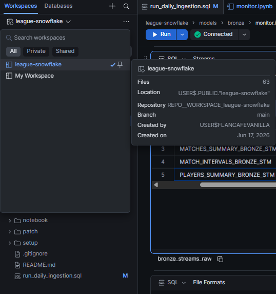
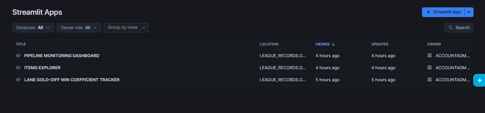
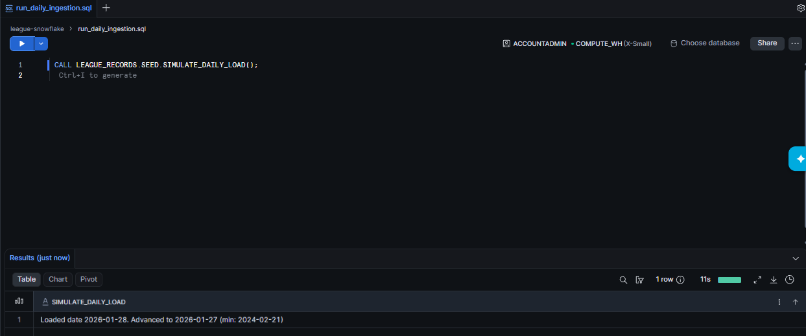
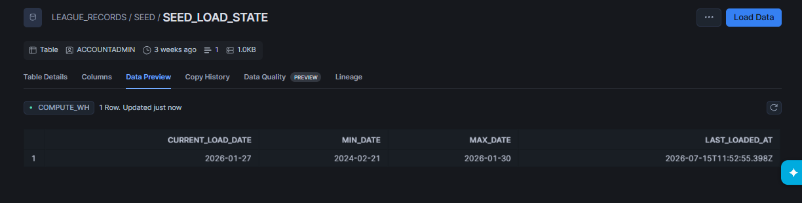

# Install Guide

You can get the full pipeline running in about 10 minutes.

Let's go step by step.

---

## Prerequisites

You need:

* A **Snowflake account** with `ACCOUNTADMIN` role (a free trial works perfectly)
* A **GitHub account** (just to download files, no push access needed)

That's it. Everything else runs inside Snowflake.

---

## 01. Create the Workspace

First, you'll connect this repo to Snowflake as a **Workspace** so you can run the SQL files directly.

In Snowsight:

1. Click **Workspaces** (top-left nav)
2. Click **+** → **Create new → Git Workspace**
3. Paste the repository URL:

```
https://github.com/TotoriYoyori/league-snowflake
```

4. Under **API Integration**, click **+ API Integration** and create one:
   * Name: `GITHUB_TOTORI_YOYORI`
   * Allowed prefix: `https://github.com/TotoriYoyori/`
5. Select **Public Repository**
6. 👉 **Click Create**

> **Warning:** Keep the Workspace name exactly `league-snowflake` (Snowsight defaults to this from the repo URL,
don't rename it!). Every `EXECUTE IMMEDIATE FROM 'snow://workspace/USER$.PUBLIC."league-snowflake"/...'` 
call in `01_deploy.sql` depends on this name. See picture below for example of this name.



You'll now see every file in the repo in your Workspace file tree.

> **Info:** The workspace fetches a read-only copy of the repo (that means no pushing). You can open and run 
any `.sql` file directly from the tree. 

---
## 02. Deploy the Pipeline

👉 **Open `setup/01_deploy.sql` from the file tree, then Run All.**

```sql
-- That's it. One file deploys everything:
-- ✓ LEAGUE_RECORDS database
-- ✓ SEED, BRONZE, SILVER, GOLD schemas
-- ✓ Seed tables + upload stage
-- ✓ Bronze tables, streams, stages, pipes
-- ✓ Silver cleaning views, tables, tasks
-- ✓ Gold dynamic tables (self-refreshing, no task activation needed)
-- ✓ All patches applied
-- ✓ All stored procedures
```

---

## 03. Download the Data

Go to the **GitHub releases** page:

👉 **https://github.com/TotoriYoyori/league-snowflake/releases/tag/sample**

👉 **Download these 5 files under Assets:**

| File | Rows | Size |
|------|------|------|
| `matches_summary.csv.gz` | ~40K | 1 MB |
| `players_summary.csv.gz` | ~400K | 2.5 MB |
| `intervals.csv.gz` | ~2.1M | ~64 MB |
| `items_ref.csv.gz` | 635 | 6 KB |
| `champions_ref.csv.gz` | 173 | 2 KB |

---

## 04. Upload to the Seed Stage

Now you'll put those files into Snowflake.

In Snowsight, in the sidebar to the left, navigate to:

**Catalog → Databases → LEAGUE_RECORDS → SEED → Stages → SEED_UPLOAD_STG**

👉 **Click + Files and upload all 5 files you just downloaded.**

That's the only manual step. Everything after this is automated SQL.

> **Tip:** The files can be in any order. The stage just needs to see these prefixes: `matches_summary`, 
`players_summary`, `intervals`, `items_ref`, `champions_ref`.

Internal-stage directory listings can lag a few seconds behind an upload. If `02_seed_source.sql`'s validation 
step (next) reports a file missing right after you just uploaded it, wait a moment and re-run rather than assuming 
the upload failed.

---
## 05. Load the Seed Data

👉 **Open `setup/02_seed_source.sql` and Run All.**

Here's what happens under the hood:

1. **Validation guard**: calls `SEED.VALIDATE_SEED_UPLOAD()` which checks the stage for all 5 required files. 
If anything is missing, it stops with a clear error:

```
Missing files in @SEED.SEED_UPLOAD_STG: intervals, champions_ref.
Upload via Snowsight UI before running 02_seed_source.sql.
```

2. **COPY INTO**: loads each file into its seed table

3. **Verify**: shows row counts:

```
SEED_MATCHES_SUMMARY    | 39,954
SEED_PLAYERS_SUMMARY    | 399,540
SEED_MATCH_INTERVALS    | 2,115,696
SEED_ITEMS_REF          | 635
SEED_CHAMPIONS_REF      | 173
```


4. **Reference bootstrap**: The two small reference tables get loaded one time into their bronze table directly.

5. **Kickstart**: calls `SEED.SIMULATE_DAILY_LOAD()` once, staging the first simulated day's matches/players/intervals 
straight into Bronze. Tasks aren't active yet (next step), so this data just sits in the Bronze streams for now.

> **Warning:** If the validation fails, don't skip it and run the COPY statements manually. Go back and upload the 
missing files first. The COPY INTO will succeed on empty stage paths without error. It'll just load zero rows silently.

---
## 06. Activate the Tasks

👉 **Open `setup/03_activate_tasks.sql` and Run All.**

This resumes all the tasks that move data from bronze → silver, since all tasks start suspended after first created.

```sql
ALTER TASK SILVER.BRONZE_TO_SILVER_MATCHES_TASK RESUME;
ALTER TASK SILVER.BRONZE_TO_SILVER_PLAYERS_TASK RESUME;
ALTER TASK SILVER.BRONZE_TO_SILVER_ITEMS_TASK RESUME;
ALTER TASK SILVER.BRONZE_TO_SILVER_CHAMPIONS_TASK RESUME;
ALTER TASK SILVER.BRONZE_TO_SILVER_INTERVALS_TASK RESUME;
```

Each task runs on a **1-minute schedule** and only fires when its bronze stream has new data. No data in the stream? 
It skips, no cost accrued.

> **Tip:** The previous step already staged one day of data into Bronze, so these tasks have real work waiting 
the moment they're resumed. Give it a minute or two for the first scheduled run to actually fire, then head to 
[Check That It Works](#check-that-it-works) below.

---
## 07. Deploy the Streamlit Apps

👉 **Open `setup/04_create_streamlit_app.sql` and Run All**, same context as before (`ACCOUNTADMIN`, a warehouse selected).

### Find your apps
In Snowsight, in the sidebar: **Projects → Streamlit**, or run:

```sql
SHOW STREAMLITS IN DATABASE LEAGUE_RECORDS;
```



Click any app name to open it. Each opens against the `STREAMLIT_WH` warehouse created above.
First load may take a few seconds for the warehouse to figure things out. Also note that **the pipeline needs
time to process new data**, so it might take up to 5 minutes before your app picks up new data and loads correctly.

----
# How to Use
This section covers the following:
1. How to use the simulated daily ingestion system
2. Verify that the pipeline is working
3. How to rebuild the pipeline

## Simulate Daily Ingestion

The seed tables hold the *full* historical dataset. The `SIMULATE_DAILY_LOAD()` procedure stages **one day at a time**.

Note that for this pipeline the **latest date is ingested first then going backward**. This is because the number of records
are sparse on older dates unfortunately, while more recent dates allows you to ingest more records, but the idea of daily simulation 
is the same.

### 👉 Whenever you want to ingest 'another day worth of data', open `run_daily_ingestion.sql` at the workspace root and click **Run All**.

That's the only file you need going forward.

> **Info:** You will have already loaded one day back in [Load the Seed Data](#05-load-the-seed-data)!

Output:
```
Loaded date 2026-01-30. Next: 2026-01-29
```



Run it again → next day loads. And again. Keep going as many days as you want.

`SEED_LOAD_STATE` after several runs. `CURRENT_LOAD_DATE` visibly earlier than `MAX_DATE`, proof the simulation advances over repeated runs, not just once:



## Check That It Works
Give it 1-5 minutes for the pipeline to load data through each layer.

👉 **Run this single query to verify data is flowing through every layer at once:**

```sql
-- One grid: bronze landed it, silver cleaned it, gold aggregated it, seed tracks where we are.
SELECT LAYER, TABLE_NAME, ROW_COUNT, DETAIL
FROM (
    SELECT 
        1 AS SEQ, 
        'BRONZE' AS LAYER, 
        'MATCHES_SUMMARY_BRONZE' AS TABLE_NAME, 
        COUNT(*) AS ROW_COUNT, NULL AS DETAIL
    FROM LEAGUE_RECORDS.BRONZE.MATCHES_SUMMARY_BRONZE
        UNION ALL
    SELECT 2, 'BRONZE', 'PLAYERS_SUMMARY_BRONZE', COUNT(*), NULL
    FROM LEAGUE_RECORDS.BRONZE.PLAYERS_SUMMARY_BRONZE
        UNION ALL
    SELECT 3, 'BRONZE', 'MATCH_INTERVALS_BRONZE', COUNT(*), NULL
    FROM LEAGUE_RECORDS.BRONZE.MATCH_INTERVALS_BRONZE
        UNION ALL
    SELECT 4, 'SILVER', 'MATCHES_SUMMARY_SILVER', COUNT(*), NULL
    FROM LEAGUE_RECORDS.SILVER.MATCHES_SUMMARY_SILVER
        UNION ALL
    SELECT 5, 'SILVER', 'PLAYERS_SUMMARY_SILVER', COUNT(*), NULL
    FROM LEAGUE_RECORDS.SILVER.PLAYERS_SUMMARY_SILVER
        UNION ALL
    SELECT 6, 'SILVER', 'TEAM_INTERVAL_SILVER', COUNT(*), NULL
    FROM LEAGUE_RECORDS.SILVER.TEAM_INTERVAL_SILVER
        UNION ALL
    SELECT 7, 'SILVER', 'PLAYER_INTERVAL_SILVER', COUNT(*), NULL
    FROM LEAGUE_RECORDS.SILVER.PLAYER_INTERVAL_SILVER
        UNION ALL
    SELECT 8, 'GOLD', 'MATCH_TEAM_STATS_SUMMARY', COUNT(*), NULL
    FROM LEAGUE_RECORDS.GOLD.MATCH_TEAM_STATS_SUMMARY
        UNION ALL
    SELECT 9, 'GOLD', 'PLAYER_STATS_SUMMARY', COUNT(*), NULL
    FROM LEAGUE_RECORDS.GOLD.PLAYER_STATS_SUMMARY
        UNION ALL
    SELECT 10, 'GOLD', 'DIFF_INTERVAL_STATE', COUNT(*), NULL
    FROM LEAGUE_RECORDS.GOLD.DIFF_INTERVAL_STATE
        UNION ALL
    SELECT 11, 'SEED', 'SEED_LOAD_STATE', NULL,
        'current=' || COALESCE(TO_VARCHAR(CURRENT_LOAD_DATE), '<null>')
        || '  min=' || COALESCE(TO_VARCHAR(MIN_DATE), '<null>')
        || '  max=' || COALESCE(TO_VARCHAR(MAX_DATE), '<null>')
        || '  last_loaded_at=' || COALESCE(TO_VARCHAR(LAST_LOADED_AT), '<null>')
    FROM LEAGUE_RECORDS.SEED.SEED_LOAD_STATE
) AS T
ORDER BY SEQ;
```
You should be seeing something like this, with perhaps different row count numbers from mine (since my version here
has simulated daily ingestion by couple days ahead)


> **Tip:** If silver tables are empty but bronze has data, wait 1-2 minutes for the tasks to fire. You can check task history with:
>
> ```sql
> SELECT NAME, STATE, QUERY_START_TIME
> FROM TABLE(INFORMATION_SCHEMA.TASK_HISTORY(
>     SCHEDULED_TIME_RANGE_START => DATEADD('hour', -1, CURRENT_TIMESTAMP())
> ))
> ORDER BY QUERY_START_TIME DESC;
> ```

> **Warning:** Gold tables are **dynamic tables**, not tasks. They refresh on their own schedule (`TARGET_LAG`), 
not the moment new silver data lands. `GOLD.MATCH_TEAM_STATS_SUMMARY` is set to `TARGET_LAG = '1 day'`, so it can 
take up to a day to reflect a fresh load on its own. If you want to see current data immediately (e.g. right 
before opening a Streamlit app below), force a refresh instead of waiting by **running the query block below.**
>
> ```sql
> ALTER DYNAMIC TABLE LEAGUE_RECORDS.GOLD.PLAYER_STATS_SUMMARY REFRESH;
> ALTER DYNAMIC TABLE LEAGUE_RECORDS.GOLD.CHAMPION_INTERVALS REFRESH;
> ALTER DYNAMIC TABLE LEAGUE_RECORDS.GOLD.CHAMPION_OVERVIEW REFRESH;
> ALTER DYNAMIC TABLE LEAGUE_RECORDS.GOLD.MATCH_TEAM_STATS_SUMMARY REFRESH;
> ALTER DYNAMIC TABLE LEAGUE_RECORDS.GOLD.ITEM_STATS_AND_RECOMMENDATIONS REFRESH;
> ALTER DYNAMIC TABLE LEAGUE_RECORDS.GOLD.DIFF_INTERVAL_STATE REFRESH;
> ```

## Rebuilding Pipeline
You can re-run `01_deploy.sql` through `04_create_streamlit_app.sql` in sequence to 
rebuild everything from scratch at any time. 

Note that `01_deploy.sql` starts with `CREATE OR REPLACE DATABASE`, which **drops all existing pipeline objects** 
as well as **any current data stored within**. Unless you know what you are doing, or are looking to do a rebuild,
I would stay away from `01_deploy.sql` beyond the first time you run it.

You will have to reupload the seed .csv files to the stage after a rebuild if you want data back.
